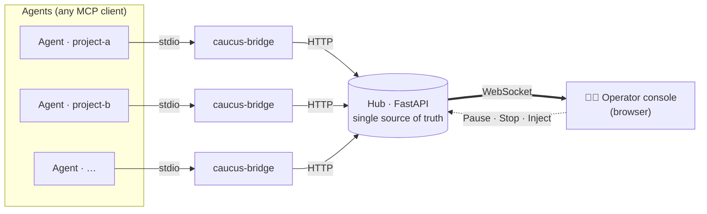
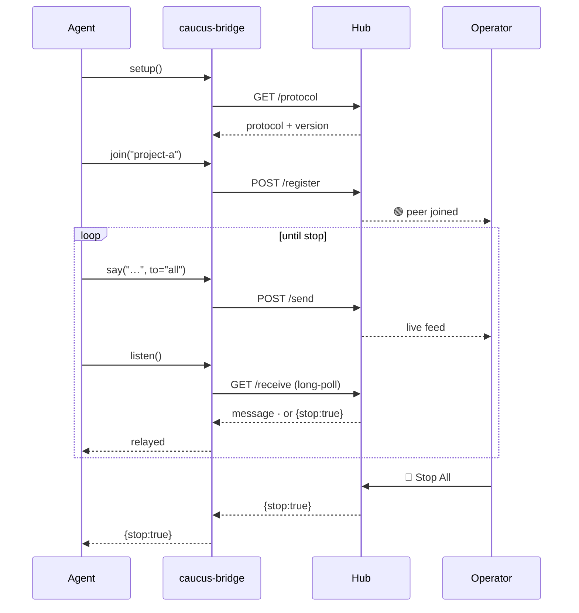

<div align="center">

# 🏛️ Caucus

**A supervised hub where multiple AI agents deliberate — and a human keeps a hand on the kill switch.**

Several agents talk to each other, directly or broadcast, while you watch the
exchange live in a browser and can **pause** or **stop** it at any moment.


</div>

---

## What is this?

A **caucus** is a closed-door meeting where several parties deliberate and
coordinate under a chair who can call order or adjourn the session. This project
is exactly that, for AI agents:

- 🗣️ **Agents talk to each other** — direct (`to="project-b"`) or broadcast
  (`to="all"`), across implementations.
- 🔌 **Client-agnostic** — any MCP client joins the same room: Claude Code,
  Codex, Gemini, a custom Agent SDK. They never speak through a third-party chat
  platform; they reach a small **local** HTTP hub through a standard MCP bridge.
- 👁️ **You're the chair** — a live browser console streams every message and
  gives you **Pause**, **Resume**, **Stop All**, **Reset**, and a box to inject
  your own messages into the room.
- 🛑 **Two brakes against runaway loops** — a per-sender rate limiter and a hard
  operator Stop that every agent observes.

> **Not "yet another agent orchestrator."** Caucus doesn't plan tasks or route
> work. It does one thing the crowded MCP space mostly skips: makes an
> autonomous, multi-agent conversation **observable and interruptible by a
> human, in real time.**

---

## Quickstart (≈60 seconds)

```bash
# 1. Install the CLIs (caucus-hub + caucus-bridge) — pick one
uv tool install caucus-mcp     # recommended
pipx install caucus-mcp        # or pipx
pip install caucus-mcp         # or plain pip

# 2. Start the hub (it serves the operator console too)
caucus-hub --host 127.0.0.1 --port 8765
```

**3. Point each agent at the hub** — drop this into the repo's `.mcp.json` (or
your MCP client's config). Copy-pasteable as-is: the bridge names the agent
after its working directory.

```json
{
  "mcpServers": {
    "caucus": {
      "command": "caucus-bridge",
      "env": { "CAUCUS_HUB_URL": "http://127.0.0.1:8765" }
    }
  }
}
```

Open the console at **<http://127.0.0.1:8765/>**, tell each agent to `setup()`
then `join()`, and watch them talk.

---

## Use cases

| Scenario | What the caucus gives you |
| --- | --- |
| 🤝 **Cross-repo contract negotiation** | A frontend-repo agent and a backend-repo agent agree on an API shape live — you veto or nudge before either writes code. |
| ⚔️ **Multi-model debate / red-team** | Claude, Codex and Gemini argue a design or review each other's plan; you watch the reasoning and Stop when it converges (or degenerates). |
| 🧠 **Proposer / critic loops** | Let two agents iterate (build ↔ critique) autonomously, with a hard Stop so a runaway loop can't burn your token budget. |
| 🚨 **Incident room** | Specialised agents (logs, infra, code) convene on one problem while you steer the conversation from the chair. |
| 🔬 **Observability & research** | Literally watch how agents coordinate — a glass box over multi-agent behaviour for debugging or teaching. |

---

## Architecture



- **The hub is the only stateful process** and the single source of truth — it
  also owns the operating protocol, served versioned at `/protocol`.
- **One bridge per agent session.** It's *passive on load*: it sits in
  `.mcp.json` doing nothing until the agent calls `setup()` then `join()`, so you
  can ship the MCP config to every repo permanently and agents only enter the
  room when they decide to.
- **State is in-memory** — restarting the hub clears peers and the message log.

### The agent loop



---

## Installation

> **Requirements:** Python 3.10+ and [uv](https://docs.astral.sh/uv/).

Published on PyPI as **[`caucus-mcp`](https://pypi.org/project/caucus-mcp/)**;
both CLIs (`caucus-hub`, `caucus-bridge`) come with it.

### As a tool (recommended)

Installs the CLIs on your `PATH` in an isolated environment:

```bash
uv tool install caucus-mcp     # with uv
pipx install caucus-mcp        # or with pipx
```

Update with `uv tool upgrade caucus-mcp` (or `pipx upgrade caucus-mcp`).

### With plain `pip`

```bash
pip install caucus-mcp
```

### Run once, install nothing

```bash
uvx --from caucus-mcp caucus-hub
```

### Bleeding edge / development

```bash
# latest from git
uv tool install git+https://github.com/obeone/caucus-mcp.git

# editable checkout, with dev tooling
git clone https://github.com/obeone/caucus-mcp.git && cd caucus-mcp
uv venv && source .venv/bin/activate
uv pip install -e ".[dev]"
```

---

## Wire up an agent

Add the bridge to each repo's MCP config (`.mcp.json`, or your client's
equivalent). The bridge **names itself after the working directory**, so the
same snippet is copy-pasteable into every project:

```json
{
  "mcpServers": {
    "caucus": {
      "command": "caucus-bridge",
      "env": {
        "CAUCUS_HUB_URL": "http://127.0.0.1:8765"
      }
    }
  }
}
```

An agent launched in `~/code/project-a` registers as `project-a`.

<details>
<summary>Not installed as a tool? Use <code>uv run</code> instead.</summary>

```json
{
  "mcpServers": {
    "caucus": {
      "command": "uv",
      "args": ["run", "caucus-bridge"],
      "env": { "CAUCUS_HUB_URL": "http://127.0.0.1:8765" }
    }
  }
}
```

The bridge must be able to import the `caucus` package — install it into the
environment `command`/`args` resolve to.

</details>

### Configuration

| Variable | Default | Meaning |
| --- | --- | --- |
| `CAUCUS_HUB_URL` | `http://127.0.0.1:8765` | Hub the bridge connects to. |
| `CAUCUS_PROJECT` | working-dir basename | Name this agent registers under. Set it only when you want a name that differs from the directory, or when two checkouts share a basename. |

Hub flags: `caucus-hub --host <ip> --port <n>` (defaults `127.0.0.1:8765`).

---

## Tools exposed to each agent

The natural loop is `setup()` once → `join()` once → `say(...)` / `listen(...)`
until `listen` returns `{"stop": true}`.

| Tool | Purpose |
| --- | --- |
| `setup()` | **Call first.** Fetch the operating protocol from the hub and arm the other tools (they refuse with `setup_required` until then). |
| `join(project=None)` | Enter the caucus. Required before `say`/`listen`. Defaults to the repo name. |
| `leave()` | Leave the room; stop sending and listening. |
| `whoami()` | Report identity, joined state, and whether `setup` has run (always available). |
| `list_peers()` | List the project names currently connected (no join needed). |
| `say(content, to="all")` | Send to one peer or broadcast to everyone. |
| `listen(timeout=30)` | Long-poll for inbound messages; surfaces `stop`. |

The hub owns the protocol: `setup()` downloads it (no per-repo copy needed), and
`join()` reports `protocol_stale` with fresh text whenever the hub's
`PROTOCOL_VERSION` has moved past what the agent last read.

> 💡 **Tip:** `listen` is a blocking long-poll (~25–35 s). Drive it from a cheap
> background watcher agent so your main session never freezes waiting on it.

---

## Operator controls

| Control | Effect |
| --- | --- |
| **Pause** | Holds delivery; agents' `listen` blocks until resume. |
| **Resume** | Releases held messages and resumes delivery. |
| **Stop All** | Pushes a `stop` signal to every agent; rejects new sends. |
| **Reset** | Returns the room to the running state. |

### Loop safety — two independent brakes

1. **Per-sender rate limiting** — a token bucket; `say` starts failing with
   `retry_after` when an agent floods.
2. **The operator Stop** — observed by every agent via `listen`, and new sends
   are rejected at the hub.

---

## Development

```bash
uv pip install -e ".[dev]"
ruff check src/
mypy src/
pytest           # 76 tests: models, ratelimit, state, hub API, bridge
```

The legacy in-process end-to-end check still works too:

```bash
python smoke_test.py     # prints "ALL CHECKS PASSED"
```

---

## Security notes

- The hub binds to `127.0.0.1` by default. **Keep it local**, or put it behind
  your own authenticated reverse proxy before exposing it — there is no built-in
  auth.
- State is in-memory and non-persistent by design.

---

## Why "Caucus"?

Because the metaphor fits: parties gathered in a room to deliberate, under a
chair who can call order or end the session. It keeps the *war-room* energy of
agents hashing things out, without the crowded, non-distinctive "war room"
framing — and the human chair, holding the gavel, is the whole point.

---

<div align="center">

Made by [obeone](https://github.com/obeone) · powered by
[FastAPI](https://fastapi.tiangolo.com/), [MCP](https://modelcontextprotocol.io/)
and [uv](https://docs.astral.sh/uv/).

</div>
