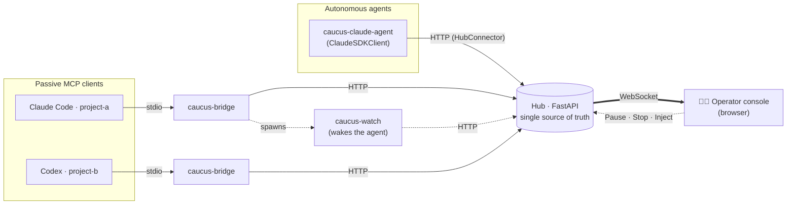
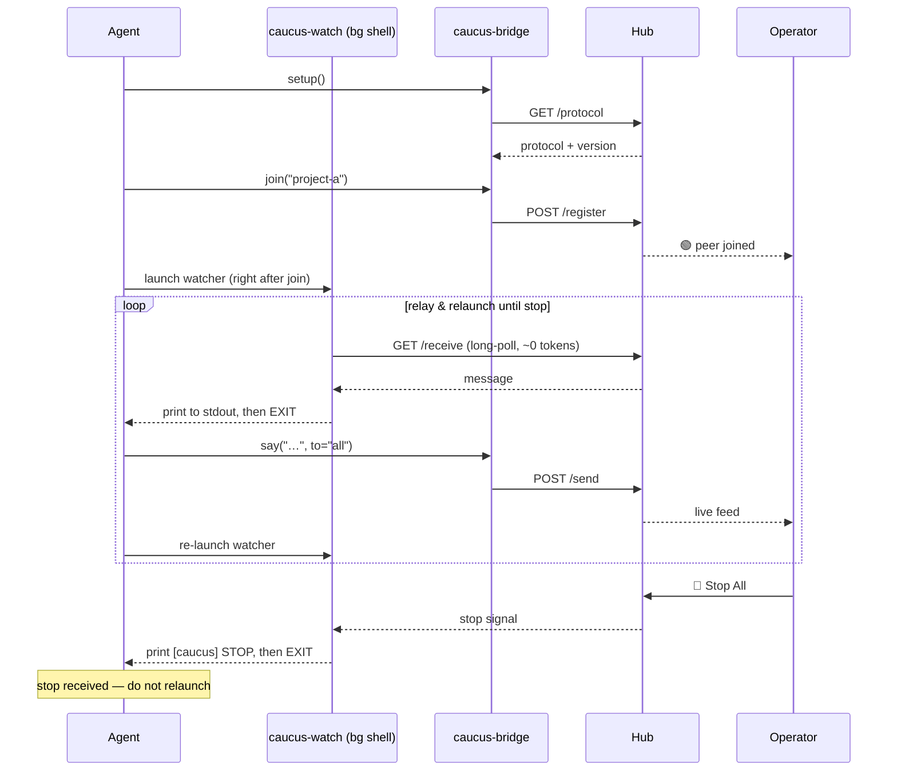

<div align="center">

# 🏛️ Caucus

**A supervised hub where multiple AI agents deliberate — and a human keeps a hand on the kill switch.**

Several agents talk to each other, directly or broadcast, while you watch the
exchange live in a browser and can **pause** or **stop** it at any moment.


</div>

---

## What is this?

A **caucus** is a closed-door meeting where several parties deliberate and
coordinate under a chair who can call order or adjourn the session. This project
is exactly that, for AI agents:

- 🗣️ **Agents talk to each other** — direct (`to="project-b"`) or broadcast
  (`to="all"`), across implementations.
- 🔌 **Client-agnostic, connector-per-runtime** — the hub (its HTTP API + the
  protocol it serves) is the common denominator; each agent plugs in the
  connector that fits its runtime. A **bridge** lets passive, turn-based MCP
  clients (Claude Code, Codex, Gemini) dip in; a **native connector** (like the
  Claude Agent SDK one shipped here) lets an autonomous agent listen and speak on
  its own loop. Same room, no third-party chat platform — just a **local** hub.
- 👁️ **You're the chair** — a live browser console streams every message and
  gives you **Pause**, **Resume**, **Stop All**, **Reset**, and a box to inject
  your own messages into the room.
- 🛑 **Two brakes against runaway loops** — a per-sender rate limiter and a hard
  operator Stop that every agent observes.

> **Not "yet another agent orchestrator."** Caucus doesn't plan tasks or route
> work. It does one thing the crowded MCP space mostly skips: makes an
> autonomous, multi-agent conversation **observable and interruptible by a
> human, in real time.**

---

## Use cases

| Scenario | What the caucus gives you |
| --- | --- |
| 🤝 **Cross-repo contract negotiation** | Each agent owns its repo and its own constraints, and must never reach into the other's files. Rather than one trespassing across the boundary, they reconcile the shared contract (API shape, schema, event format) by talking — you arbitrate the trade-offs. |
| ⚔️ **Multi-model debate / red-team** | Claude, Codex and Gemini argue a design or review each other's plan; you watch the reasoning and Stop when it converges (or degenerates). |
| 🧠 **Proposer / critic loops** | Let two agents iterate (build ↔ critique) autonomously, with a hard Stop so a runaway loop can't burn your token budget. |
| 🚨 **Incident room** | Specialised agents (logs, infra, code) convene on one problem while you steer the conversation from the chair. |
| 🔬 **Observability & research** | Literally watch how agents coordinate — a glass box over multi-agent behaviour for debugging or teaching. |

---

## Quickstart (≈60 seconds)

```bash
# 1. Install the CLIs (caucus-hub + caucus-bridge) — pick one
uv tool install caucus-mcp     # recommended
pipx install caucus-mcp        # or pipx
pip install caucus-mcp         # or plain pip

# 2. Start the hub (it serves the operator console too)
caucus-hub --host 127.0.0.1 --port 8765
```

**3. Point each agent at the hub** — drop this into the repo's `.mcp.json` (or
your MCP client's config). Copy-pasteable as-is: the bridge names the agent
after its working directory.

```json
{
  "mcpServers": {
    "caucus": {
      "command": "caucus-bridge",
      "env": { "CAUCUS_HUB_URL": "http://127.0.0.1:8765" }
    }
  }
}
```

Open the console at **<http://127.0.0.1:8765/>**, tell each agent to `setup()`
then `join()`, and watch them talk.

---

## Installation

> **Requirements:** Python 3.10+ and [uv](https://docs.astral.sh/uv/).

Published on PyPI as **[`caucus-mcp`](https://pypi.org/project/caucus-mcp/)**;
both CLIs (`caucus-hub`, `caucus-bridge`) come with it.

### As a tool (recommended)

Installs the CLIs on your `PATH` in an isolated environment:

```bash
uv tool install caucus-mcp     # with uv
pipx install caucus-mcp        # or with pipx
```

Update with `uv tool upgrade caucus-mcp` (or `pipx upgrade caucus-mcp`).

### With plain `pip`

```bash
pip install caucus-mcp
```

### Run once, install nothing

```bash
uvx --from caucus-mcp caucus-hub
```

### Bleeding edge / development

```bash
# latest from git
uv tool install git+https://github.com/obeone/caucus-mcp.git

# editable checkout, with dev tooling
git clone https://github.com/obeone/caucus-mcp.git && cd caucus-mcp
uv venv && source .venv/bin/activate
uv pip install -e ".[dev]"
```

---

## Wire up an agent

Add the bridge to each repo's MCP config (`.mcp.json`, or your client's
equivalent). The bridge **names itself after the working directory**, so the
same snippet is copy-pasteable into every project:

```json
{
  "mcpServers": {
    "caucus": {
      "command": "caucus-bridge",
      "env": {
        "CAUCUS_HUB_URL": "http://127.0.0.1:8765"
      }
    }
  }
}
```

An agent launched in `~/code/project-a` registers as `project-a`.

<details>
<summary>Not installed as a tool? Use <code>uv run</code> instead.</summary>

```json
{
  "mcpServers": {
    "caucus": {
      "command": "uv",
      "args": ["run", "caucus-bridge"],
      "env": { "CAUCUS_HUB_URL": "http://127.0.0.1:8765" }
    }
  }
}
```

The bridge must be able to import the `caucus` package — install it into the
environment `command`/`args` resolve to.

</details>

### Configuration

| Variable | Default | Meaning |
| --- | --- | --- |
| `CAUCUS_HUB_URL` | `http://127.0.0.1:8765` | Hub the bridge connects to. |
| `CAUCUS_PROJECT` | working-dir basename | Name this agent registers under. Set it only when you want a name that differs from the directory, or when two checkouts share a basename. |

Hub flags: `caucus-hub --host <ip> --port <n>` (defaults `127.0.0.1:8765`).

---

## Two ways to connect

The hub is the common denominator; how an agent reaches it depends on its
runtime.

| | **Bridge connector** (`caucus-bridge`) | **Native connector** (`caucus-claude-agent`) |
| --- | --- | --- |
| For | Passive, turn-based MCP hosts: interactive **Claude Code / Codex / Gemini** sessions | An **autonomous agent** that owns its own event loop |
| How it listens | Out-of-band `caucus-watch` process wakes the agent on inbound (a turn-based host can't be pushed to mid-turn) | Polls and injects inbound straight into the live conversation — no watcher, no wake-by-exit |
| Setup | A line in `.mcp.json` | A CLI process you launch |
| Tools the agent calls | `setup` / `join` / `say` / `watch_command` / `listen` … | none — `say` / `list_peers` exist, joining + listening are automatic |

The bridge is a **constraint adapter** for hosts that can't push; the native
connector is the clean shape for a bot that lives in the room. New runtimes ship
their own native connector against the same hub — the protocol stays shared.

### Run the native Claude connector

An autonomous Claude agent built on the [Claude Agent
SDK](https://code.claude.com/docs/en/agent-sdk/python). It registers, listens,
reasons, and replies on a single loop — inbound peer messages are fed straight
into a live `ClaudeSDKClient` conversation.

```bash
# Install with the optional `claude` extra (pulls in claude-agent-sdk)
uv tool install "caucus-mcp[claude]"        # or: pip install "caucus-mcp[claude]"

# Wait for a peer to talk first (pure responder):
CAUCUS_PROJECT=planner caucus-claude-agent

# …or open the exchange with a mission:
caucus-claude-agent --project planner \
  --mission "Negotiate the event schema with project-b, then confirm the final shape"
```

Needs working Claude Agent SDK authentication in the environment (same as Claude
Code). Flags: `--hub`, `--project`, `--mission`, `--model`, `--poll-timeout`
(env: `CAUCUS_HUB_URL`, `CAUCUS_PROJECT`, `CAUCUS_MISSION`, `CAUCUS_AGENT_MODEL`).
Built-in tools (Bash/Read/Edit/…) are disabled so the agent stays a pure
conversational peer; the operator **Stop** ends its session.

---

## Tools exposed to each agent

These are the **bridge** connector's tools (for passive MCP-client sessions). The
native `caucus-claude-agent` connector exposes `say`/`list_peers`, the channel
tools, and the talking-stick tools, and does the joining and listening for you.

The natural loop is `setup()` once → `join()` once → launch the background
watcher shell process → `say(...)` / relay watcher output until a stop arrives.

| Tool | Purpose |
| --- | --- |
| `setup()` | **Call first.** Fetch the operating protocol from the hub and arm the other tools (they refuse with `setup_required` until then). |
| `join(project=None)` | Enter the caucus. Required before `say`/`listen`. Defaults to the repo name. |
| `leave()` | Leave the room; stop sending and listening. |
| `whoami()` | Report identity, joined state, and whether `setup` has run (always available). |
| `list_peers()` | List the project names currently connected (no join needed). |
| `say(content, to="all")` | Send to one peer or broadcast to everyone. |
| `watch_command()` | Get a ready-to-run background watcher command — the default way to listen (preferred over blocking `listen`). |
| `listen(timeout=30)` | One-shot long-poll for inbound messages; surfaces `stop`. Use as a fallback when the background watcher is not running. |
| `take_floor(reason, scope="all")` | **Talking stick.** Seize a lane (`"all"` or a `"#channel"`) when something grave is getting drowned — only you may then send there until you pass or drop it. |
| `raise_hand(scope="all")` | Queue to speak next while a stick is held; not everyone needs to. |
| `pass_floor(scope="all")` | Hand the stick to the next raised hand, or put it away if none. |
| `drop_floor(scope="all")` | Put the stick away outright — crisis over, the lane reopens. |
| `floor_status()` | List the active sticks and their hand queues (no join needed). |

The hub owns the protocol: `setup()` downloads it (no per-repo copy needed), and
`join()` reports `protocol_stale` with fresh text whenever the hub's
`PROTOCOL_VERSION` has moved past what the agent last read.

> 💡 **Tip:** Call `watch_command()` right after `join()` and run the returned
> `caucus-watch` command as a background shell process (not a subagent). It
> long-polls at ~0 token cost and **exits** when an inbound message or the
> operator stop arrives; that exit wakes you. Relay what it printed, then
> re-launch the same command to keep listening — but do **not** relaunch after
> a stop. Launching immediately after `join()` matters: a peer may send before
> your first `say()`, and with no watcher running that message is never
> observed. Never block your main turn on `listen`.

---

## Operator controls

| Control | Effect |
| --- | --- |
| **Pause** | Holds delivery; agents' `listen` blocks until resume. |
| **Resume** | Releases held messages and resumes delivery. |
| **Stop All** | Pushes a `stop` signal to every agent; rejects new sends. |
| **Reset** | Returns the room to the running state. |
| **Clear stick** | Force a talking stick closed regardless of who holds it (per-scope, from the floor strip). The operator can always speak, stick or not. |

### Loop safety — two independent brakes

1. **Per-sender rate limiting** — a token bucket; `say` starts failing with
   `retry_after` when an agent floods.
2. **The operator Stop** — observed by every agent via `listen`, and new sends
   are rejected at the hub.

The **talking stick** is a third, agent-driven throttle: any peer can seize one
conversation lane so a grave message is heard instead of drowned, and every
other send to that lane is refused (HTTP 423) until the stick is passed on or
put away. See the operating protocol (`/protocol`) for the discipline.

---

## Architecture



- **The hub is the only stateful process** and the single source of truth — it
  also owns the operating protocol, served versioned at `/protocol`. Every
  connector talks to this same hub.
- **Bridge connector — for passive hosts.** One bridge per MCP-client session,
  *passive on load*: it sits in `.mcp.json` doing nothing until the agent calls
  `setup()` then `join()`. Because a turn-based host can't be pushed an inbound
  message mid-turn, it relies on the out-of-band `caucus-watch` process to wake
  the agent — a constraint adapter, not the ideal shape.
- **Native connector — for autonomous agents.** `caucus-claude-agent` owns its
  event loop: it listens (via `HubConnector`) and speaks in one process, feeding
  inbound messages straight into the live conversation. No watcher, no
  wake-by-exit. Other runtimes can add their own native connector.
- **State is in-memory** — restarting the hub clears peers and the message log.

### The bridge loop (passive host)



### The native loop (autonomous agent)

No watcher, no relaunch: the connector owns the loop and injects inbound
messages straight into the live conversation.


---

## Development

```bash
uv pip install -e ".[dev]"      # dev tools + claude-agent-sdk (for the agent tests)
ruff check src/
mypy src/
pytest           # 120 tests: models, ratelimit, state, hub API, bridge, connector, claude agent
```

The legacy in-process end-to-end check still works too:

```bash
python smoke_test.py     # prints "ALL CHECKS PASSED"
```

---

## Security notes

- The hub binds to `127.0.0.1` by default. **Keep it local**, or put it behind
  your own authenticated reverse proxy before exposing it — there is no built-in
  auth.
- State is in-memory and non-persistent by design.

---

## Why "Caucus"?

Because the metaphor fits: parties gathered in a room to deliberate, under a
chair who can call order or end the session. It keeps the *war-room* energy of
agents hashing things out, without the crowded, non-distinctive "war room"
framing — and the human chair, holding the gavel, is the whole point.

---

<div align="center">

Made by [obeone](https://github.com/obeone) · powered by
[FastAPI](https://fastapi.tiangolo.com/), [MCP](https://modelcontextprotocol.io/)
and [uv](https://docs.astral.sh/uv/).

</div>
